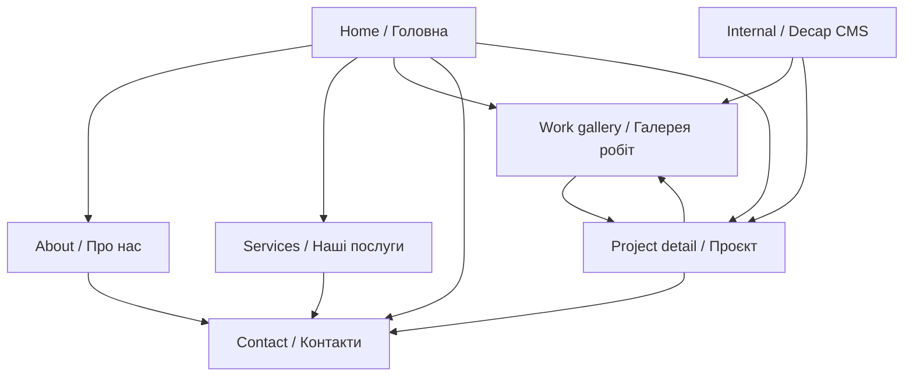

# Design Center Website User Flow

This document describes the current public navigation, project discovery, contact flow, language behavior, and editor publishing flow.

## 1. Site map

## 2. Public visitor flows

### A. Discover services and work

1. The visitor lands on the homepage.
2. They review the service categories and recent project cards.
3. A service tile opens `/services.html` for the complete localized service lists.
4. “All works” opens `/products.html`.
5. Selecting a project card opens `/projects/{id}.html`.
6. The project page presents the cover image, optional thumbnails, localized description, and previous/next navigation.
7. The visitor opens `/contact.html` or the homepage contact section to make an inquiry.

### B. Learn about the company

1. The visitor opens `/about.html`.
2. They read the company description and 25-year experience statement.
3. They review the partner-logo grid.
4. They use the phone link or Contact navigation item to start an inquiry.

### C. Submit a contact inquiry

1. The visitor uses the homepage contact section or `/contact.html`.
2. They enter name, email, subject, and an optional message.
3. Client-side validation checks required fields and length limits.
4. The form submits JSON to `/sendmail.php`.
5. Success or error feedback appears inline without navigating away.
6. Successful messages are routed to `design_office@ukr.net` with the visitor's email as `Reply-To`.

The slide-out menu contains navigation only. It links to the dedicated Contact page instead of duplicating the inquiry form.

## 3. Language flow

1. Ukrainian is used by default.
2. The visitor selects `UA` or `EN` in the header.
3. Elements with `data-i18n` are replaced from `src/locales.ts`.
4. Dynamic services and project cards are rendered again in the selected language.
5. Project detail pages show the matching localized content section.
6. The preference is saved in browser `localStorage` and reused across pages.

The language toggle does not change the URL. English pages therefore do not currently have separate indexable `/en/` addresses.

## 4. Editor publishing flow

1. An authorized editor opens `/admin/` and signs in with GitHub.
2. They choose **CRM: Projects** or **CRM: Partners**.
3. They edit an existing record or add a new one.
4. Project editors complete Ukrainian and English content, cover alt text, and any gallery-image alt text.
5. Selecting **Publish** creates a commit directly on `main`.
6. GitHub Actions installs dependencies, builds the site, and deploys `dist/` to Cityhost.
7. The editor waits approximately 60–90 seconds and checks the public page.

Unpublished projects remain editable in the CMS but do not appear in public galleries or generated project pages.

## 5. Primary interactive states

- Sticky responsive header and slide-out navigation menu.
- Ukrainian/English language selection with a persistent preference.
- Project cards with keyboard-focus and hover states.
- Project thumbnail selection and optional gallery autoplay.
- Contact-form validation, sending, success, and error states.
- Back-to-top control.
- Bilingual Internal interface and local `?backend=test` CMS sandbox.
